# Image Prompt Library

[](https://github.com/EddieTYP/image-prompt-library/actions/workflows/ci.yml)
[](https://github.com/EddieTYP/image-prompt-library/actions/workflows/pages.yml)
[](https://github.com/EddieTYP/image-prompt-library/releases/tag/v0.5.0-beta)
[](LICENSE)

ChatGPT image generation has become good enough that the prompts are worth keeping. The problem is that once you start saving great outputs, screenshots, and variations, there still is not a simple private tool for managing image prompts like a real reference library.

**Image Prompt Library** is a local-first web app for collecting generated images and the prompts behind them. When you create an image worth reusing, save it into your own self-hosted library, add the prompt, organize it into collections and tags, and search it later as a quick visual reference.

Your library stays on your own machine: local SQLite, local image files, no accounts, no cloud sync, and no hosted database required.

**Online Read Only Demo:** <https://eddietyp.github.io/image-prompt-library/> — browse public sample prompts and compressed preview images on GitHub Pages. The online demo is read-only: Add, edit, and private library management are local-only, so install the app locally to create or edit your own full library. Latest v0.5 beta supports the Local Generation Workbench in local installs.

**v0.5 beta highlight:** local installs can connect via **ChatGPT OAuth** using the experimental `openai_codex_oauth_native` provider, generate images directly from saved prompts, choose aspect ratio and quality settings, review auto-started queue jobs in the Local Generation Workbench, then `Attach to current item` or `Save as new item` with editable metadata. No hosted account, cloud sync, or public API key is required by the app.

**Beta release:** <https://github.com/EddieTYP/image-prompt-library/releases/tag/v0.5.0-beta> — Local Generation Workbench, ChatGPT OAuth direct image generation, aspect ratio and quality controls, auto-start queue with cancellation, Save-as-new variant metadata editing, versioned installer/update/rollback, and the multilingual provenance-aware prompt vault in the read-only demo.

**Roadmap:** See [`ROADMAP.md`](ROADMAP.md) for follow-up work around mobile Explore, versioned release installs, local generation, import flows, and public release polish.


The public Online Read Only Demo remains a multilingual provenance-aware prompt vault: 510 public references, two attributed sample sources, English / Traditional Chinese / Simplified Chinese prompt variants, and source/original provenance for every item. The v0.5 beta local app release adds the Local Generation Workbench on top of the private install workflow.

## What it does

- Save generated/reference images together with the prompt text that created them.
- Organize references into collections and tags so good prompts are easy to find again.
- Browse visually in **Explore view**, a thumbnail constellation that spreads images by collection in a style inspired by graph tools like Obsidian.
- Browse densely in **Cards view**, an image-first masonry gallery for scanning many prompt references quickly on desktop and mobile.
- Search across titles, prompts, tags, collections, sources, and notes.
- Filter by collection, open a detail view, and copy the prompt with one click.
- Generate New Image from a prompt, or generate a Variant of an existing one with ChatGPT Image 2.0 once you have completed OAuth.
- Keep everything local for privacy and long-term ownership.

## Screenshots

The screenshots below show the main browsing, detail, and local generation flows. The public Online Read Only Demo keeps the mobile Cards/detail improvements from 0.2 and the richer multilingual read-only prompt vault from 0.3, while the v0.5 beta local install path adds the ChatGPT OAuth Local Generation Workbench.

### Generate with ChatGPT OAuth

Once the optional ChatGPT OAuth provider is connected, local installs can generate a new image from a fresh prompt or create a variant from an existing reference. Results land in the local inbox first, where you can attach them to the current item or save them as a new item with editable metadata.

<p>
  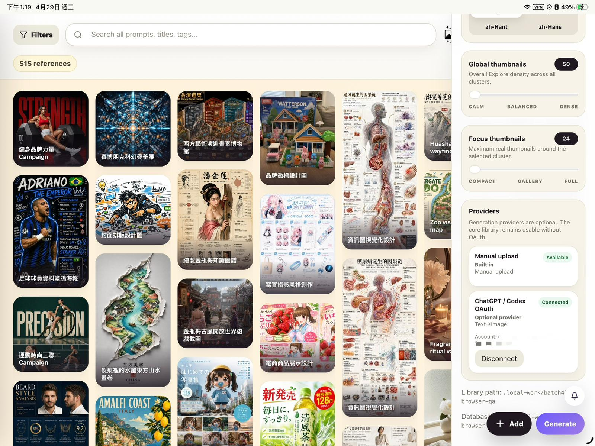
  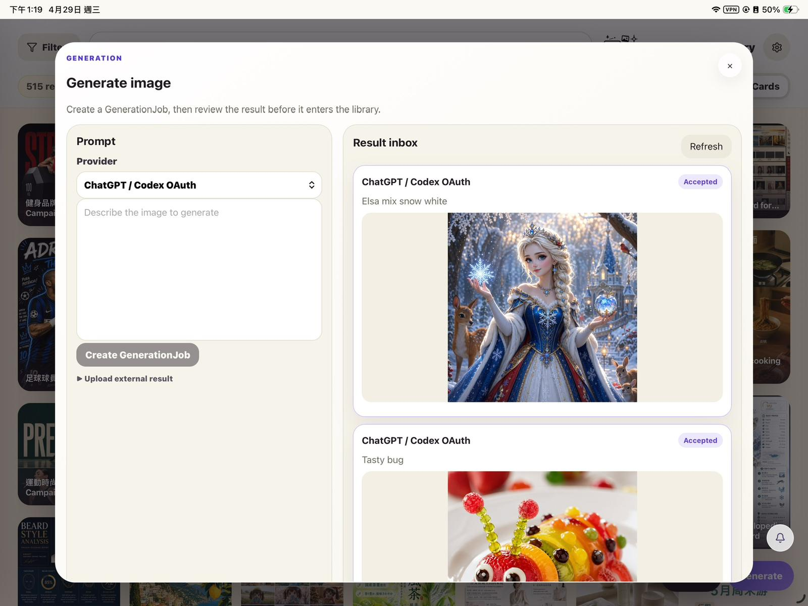
</p>
<p>
  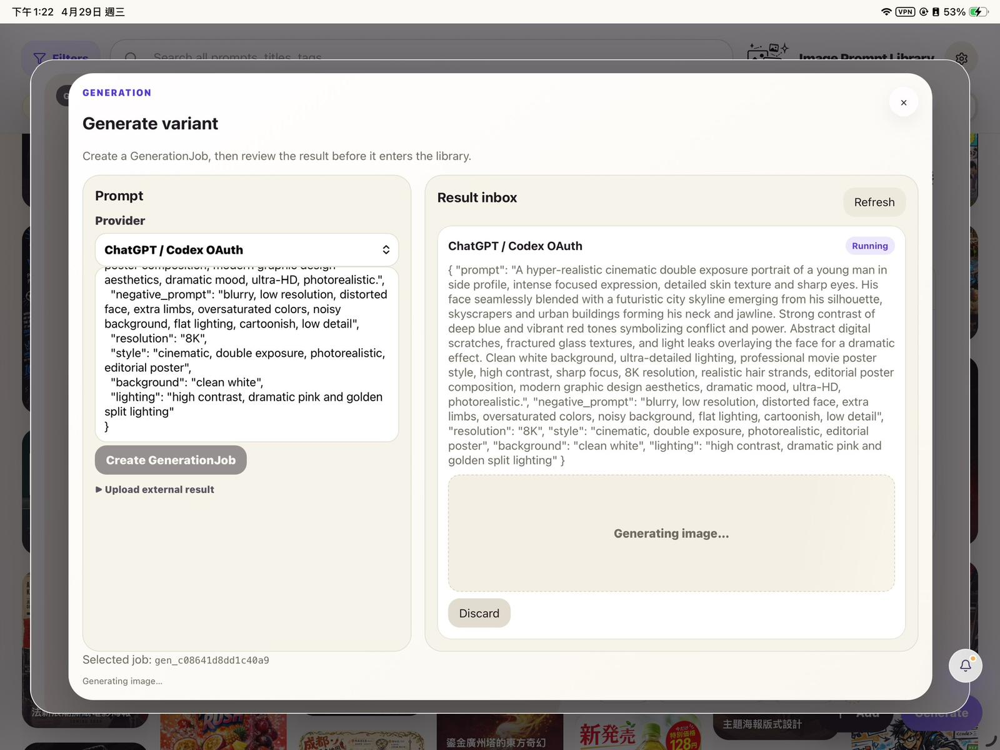
  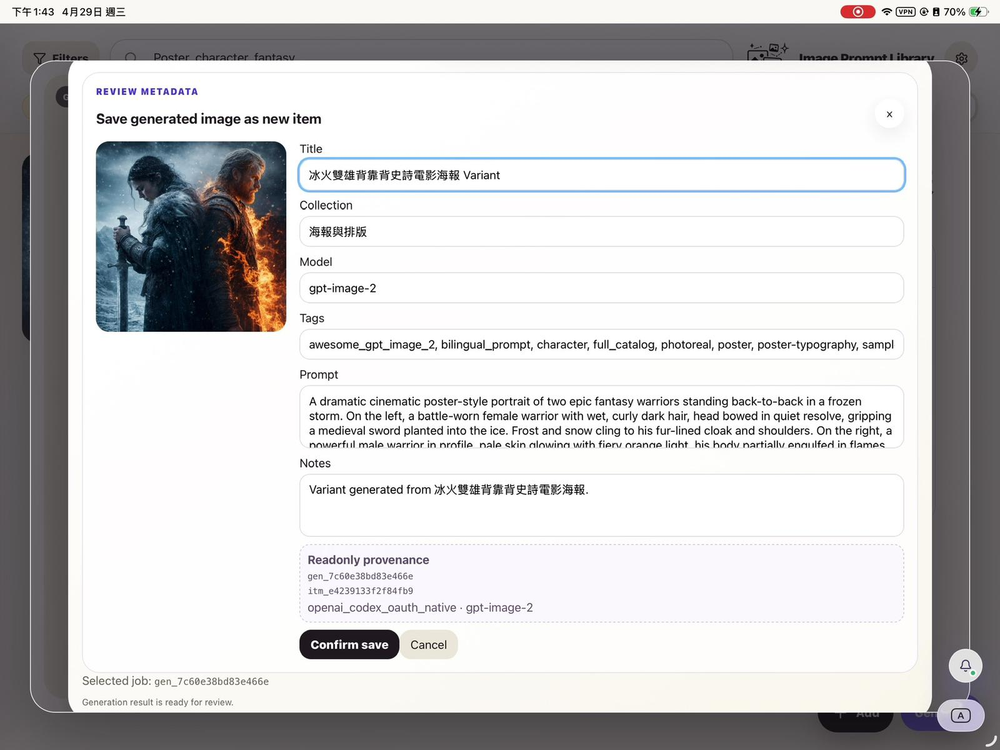
</p>

### Browse with image-first cards

Cards view is designed for fast visual scanning. The current preview uses an image-first layout with a clean title overlay, quick actions, and adaptive image display for mixed portrait, landscape, and tall reference images.


### Mobile-first browsing behavior

On phones, the app defaults to Cards view, uses a stable two-column masonry layout, keeps quick actions touch-visible, and moves the selected collection into a bottom dock instead of crowding the header. Filters open as a full-height drawer, and the detail view keeps prompt tabs and copy/edit controls reachable without switching to a desktop layout.

<p>
  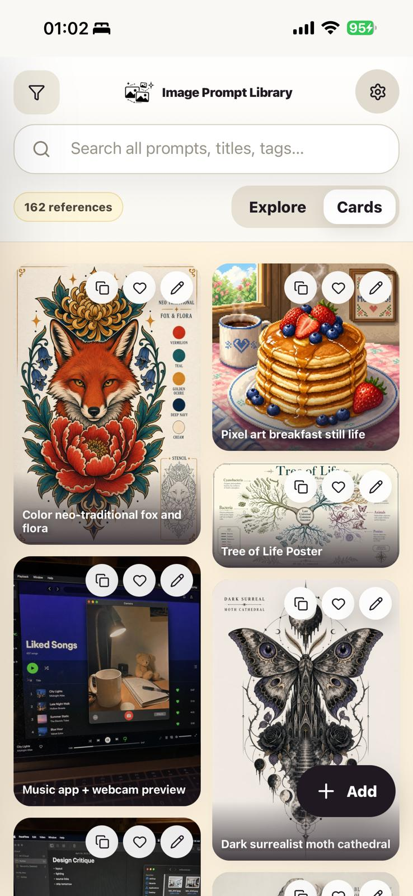
  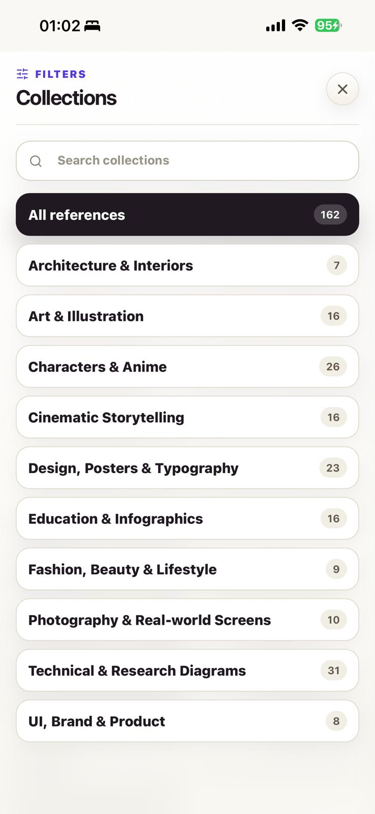
  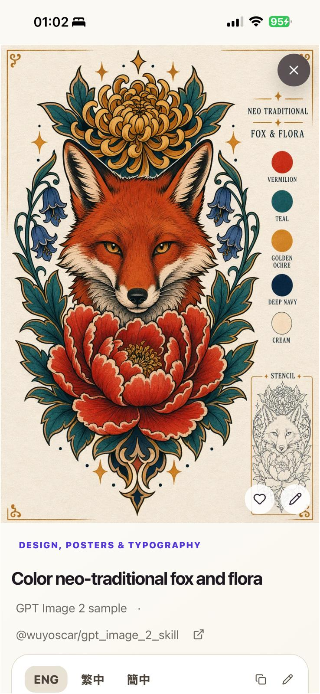
  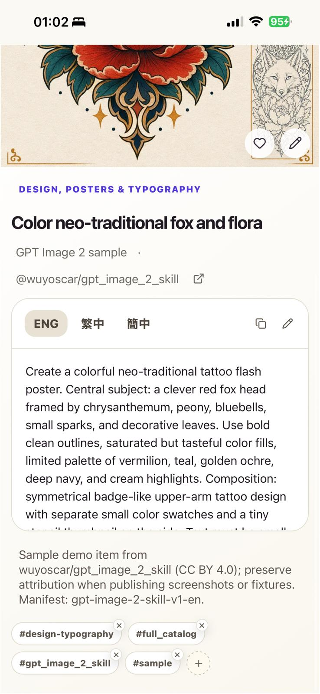
</p>

### Explore your prompt library visually

Explore view gives you a spatial overview of your library. Collections become visual hubs, with image thumbnails arranged around them so you can scan patterns, styles, and prompt families at a glance.

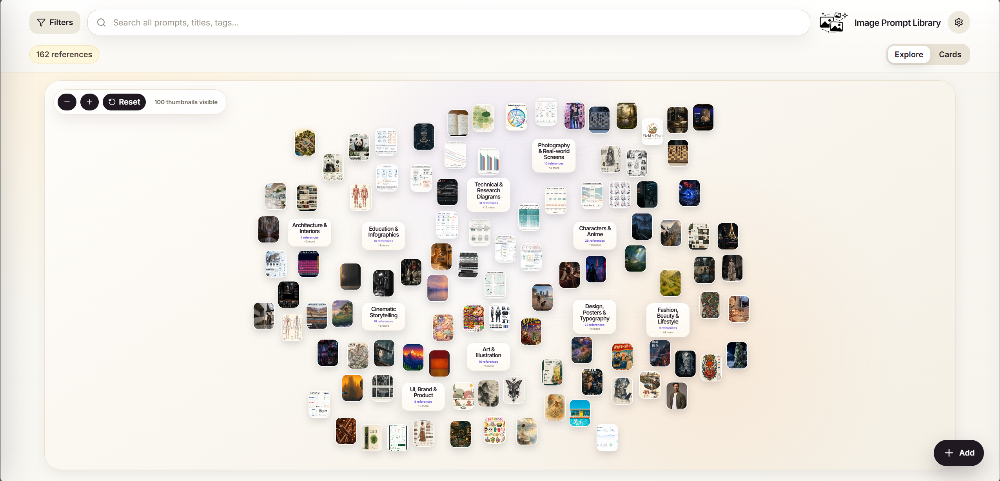

### Focus on one collection

Filters let you focus the same visual map on a single collection while keeping search, collection context, and the view switcher close at hand.

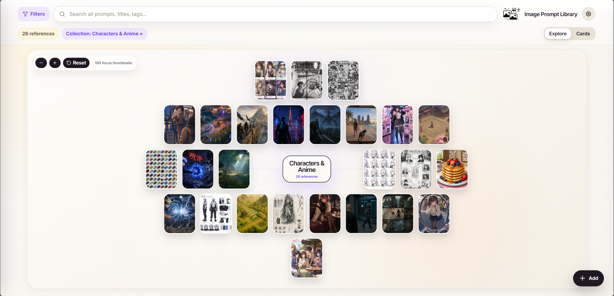

### Keep the prompt beside the image

The detail view keeps the large image preview, prompt, language tabs, attribution, notes, tags, favorite/edit actions, and one-click prompt copy in one place. On mobile, the detail view becomes image-first with floating controls over the image.


## Features

- Local SQLite database and local image files.
- Image storage with originals, previews, and thumbnails.
- Explore mode: thumbnail constellation view for visual browsing.
- Cards mode: image-first masonry/Pinterest-style prompt gallery.
- Search across titles, prompts, tags, collections, sources, and notes.
- Collections and tags for organizing references.
- Detail modal with lightweight inline editing, prompt language tabs, source/origin prompt styling, multi-image browsing, generated-image badges, and copy feedback.
- Add/edit modal with English, Traditional Chinese, and Simplified Chinese prompt fields plus metadata and a single source/origin marker.
- Result image and optional reference image uploads.
- Generate images directly in local installs through optional **ChatGPT OAuth** (`openai_codex_oauth_native`) without adding an OpenAI API key to the app.
- Local generation workflow: `Generate variant`, result inbox review, `Attach to current item`, and `Save as new item` with editable metadata before saving.
- Provider-gated generation UI: generation controls stay hidden until a configured/authenticated provider is available, while Add/Edit remains usable without any generation provider.
- Global generation queue drawer for active/succeeded/failed jobs, plus friendlier policy/rate-limit/auth/provider failure messages.
- Phone-friendly Cards behavior: two-column masonry, compact header, touch-visible actions, and bottom selected-collection dock.
- Adaptive card/detail image display for mixed portrait, landscape, and tall reference images.

## Requirements

For normal release installs:

- Python 3.10+
- `curl` or a browser to download the installer

For source/development installs:

- Python 3.10+
- Node.js 20+ recommended
- npm

Normal release installs do not require Node.js because tagged release assets include the built frontend.

For clarity: normal release installs do not require Node.js; Node.js/npm are only needed for source/development installs.

## Platform support

- macOS and Linux are the primary supported local-install targets today.
- Windows can run the app stack through **WSL 2** using the same commands as Linux.
- Native Windows PowerShell/CMD is not a supported quick-start path yet because the current helper scripts are Bash scripts and assume Unix-style virtualenv paths such as `.venv/bin/activate`. Native Windows support should use equivalent PowerShell scripts or a Docker/Compose path in a future pass.

## Quick start for normal users

Install the latest tagged release from GitHub Release assets without cloning the repo:

```bash
curl -fsSL https://raw.githubusercontent.com/EddieTYP/image-prompt-library/main/scripts/install.sh | bash
image-prompt-library start
```

Install a specific tagged release instead:

```bash
curl -fsSL https://raw.githubusercontent.com/EddieTYP/image-prompt-library/main/scripts/install.sh | bash -s -- --version v0.5.0-beta
image-prompt-library start
```

Open <http://127.0.0.1:8000/>.

The installer keeps replaceable app code under:

```text
~/.image-prompt-library/app/versions/<version>
```

Your private prompt library defaults to:

```text
~/ImagePromptLibrary
```

That data directory is separate from app code, so future updates or rollbacks should not overwrite your private SQLite database or images.

Update later with:

```bash
image-prompt-library update
```

Install or switch to a specific version with:

```bash
image-prompt-library update --version v0.5.0-beta
```

Rollback to the previous installed version with:

```bash
image-prompt-library rollback
```

Normal release installs do not require Node.js because the release artifact includes the built frontend. Node.js/npm are only needed for source/development installs.

The selected release must have matching GitHub Release assets: `image-prompt-library-<version>.tar.gz`, `.sha256`, and `.manifest.json`. The installer verifies the SHA256 checksum before switching `app/current` to the new version.

## Local generation workflow

Generate images directly in local installs after connecting the optional **ChatGPT OAuth** provider (`openai_codex_oauth_native`). This remains local-only: the GitHub Pages Online Read Only Demo is read-only and does not expose generation or mutation controls.

Current local generation behavior:

- Connect an optional provider from the Config drawer. The experimental native provider is labelled `openai_codex_oauth_native` and stores its app-owned auth outside the prompt library data path.
- Open an item and use `Generate variant`, or use the standalone `Generate` entry when a provider is connected.
- Generated outputs land in a GenerationJob result inbox first; they are not silently written into the library.
- Choose `Attach to current item` to add another image to the same reference, or `Save as new item` to review/edit title, collection, tags, prompt, and notes before creating a new variant item.
- Active, completed, and failed generation jobs appear in the compact global generation queue drawer.
- Policy, rate-limit, auth, and provider failures are shown as friendly reviewable states instead of raw error dumps.

## Developer setup from source

Use this path if you want to develop the app, inspect unreleased `main`, or run from a checkout:

```bash
git clone https://github.com/EddieTYP/image-prompt-library.git
cd image-prompt-library
./scripts/setup.sh
./scripts/start.sh
```

Open <http://127.0.0.1:8000/>.

`scripts/start.sh` builds the frontend and serves the built app through FastAPI, so source local use only needs one server after setup.

## Development mode

For frontend/backend development with Vite hot reload:

```bash
./scripts/dev.sh
```

Open <http://127.0.0.1:5177/>.

Default development ports:

- Backend API: <http://127.0.0.1:8000>
- Vite frontend: <http://127.0.0.1:5177>

## Configuration

Copy `.env.example` to `.env` and edit if needed:

```bash
cp .env.example .env
```

Important settings:

```bash
IMAGE_PROMPT_LIBRARY_PATH=./library
BACKEND_HOST=127.0.0.1
BACKEND_PORT=8000
FRONTEND_PORT=5177
BACKUP_DIR=./backups
```

`IMAGE_PROMPT_LIBRARY_PATH` controls where your private database and images live. The default `./library` is repo-local and intentionally ignored by git. For long-term personal use, you may prefer a durable path such as `~/ImagePromptLibrary`.

## Data layout

Runtime data lives under `IMAGE_PROMPT_LIBRARY_PATH`:

```text
library/db.sqlite       SQLite metadata and full-text search index
library/originals/      original uploaded/imported images
library/previews/       generated preview images
library/thumbs/         generated thumbnail images
```

Do not commit runtime `library/` data to git. It is your private prompt/image collection.

## Add your own prompts & images

1. Start the app.
2. Click `+ Add`.
3. Add a title, prompt text, collection, optional tags, and a required result image.
4. Save the card.
5. Use Cards/Explore, search, filters, and detail view to browse and copy prompts later.

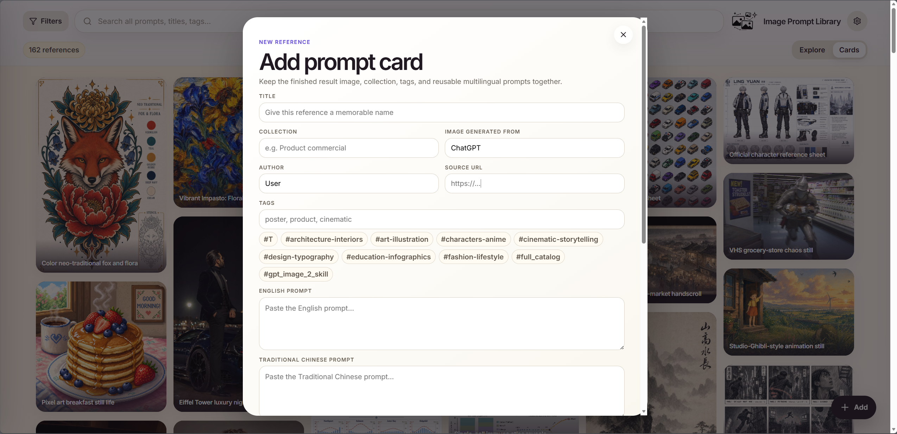

## Import and example data

The app starts with an empty private library. Your own `library/` folder contains personal prompt data and images, so it is intentionally ignored by git.

### Try the sample library

If you want to see the app with example content, install the optional sample library:

```bash
./scripts/install-sample-data.sh en
```

Then start the app and open <http://127.0.0.1:8000/>.

The installer downloads the sample image ZIP from a public sample-data release and verifies its SHA256 checksum before import. Sample manifests use schema v2 prompt provenance, so each item records one source/original prompt language and any converted or translated variants. When reproducing a sample image, copy the **Origin** prompt where available; it is usually closest to the original result.

The default sample library is based on [`wuyoscar/gpt_image_2_skill`](https://github.com/wuyoscar/gpt_image_2_skill), licensed under **CC BY 4.0**. Thank you to `wuyoscar/gpt_image_2_skill` for the curated ChatGPT image prompt gallery used as the first public sample package.

A second sample package based on [`freestylefly/awesome-gpt-image-2`](https://github.com/freestylefly/awesome-gpt-image-2), licensed under **MIT**, is available with:

```bash
./scripts/install-sample-data.sh zh_hant awesome-gpt-image-2
```

Both are included only as demo/sample content; your own prompt library data remains private and is not part of any sample bundle.

Thank you to `freestylefly/awesome-gpt-image-2` for the larger Chinese prompt/image gallery used as the second public sample package. The Image Prompt Library app code remains AGPL-3.0-or-later; third-party sample prompts/images keep their own upstream attribution and license boundary.

## Backup

Create a timestamped backup archive:

```bash
./scripts/backup.sh
```

The backup includes:

- `library/db.sqlite`
- `library/originals/`
- `library/thumbs/`
- `library/previews/`

Restore by stopping the app, extracting the archive, and replacing the corresponding library directory contents. Keep backups somewhere outside the repo if the library matters to you.

## GitHub Pages Online Read Only Demo

The repository also ships static read-only demos for GitHub Pages:

```bash
npm run build:demo
npm run build:demo:v0.4
```

The public Pages deployment is versioned. Use `/` for the version chooser or `/v0.4/` for the current 0.4 preview.

The demos read public sample metadata from `frontend/public/demo-data/`, use compressed WebP preview images, and disable write actions. They are intended only as online read-only demos. The online demo is read-only: Add, edit, and private library management are local-only, so install the app locally to create or edit your own private prompt library. Latest v0.5 beta supports the Local Generation Workbench in local installs with ChatGPT OAuth.

## Verification

Run backend/API/static tests:

```bash
source .venv/bin/activate
python -m pytest -q
```

Build the frontend:

```bash
npm run build
```

Smoke-test a running local server:

```bash
./scripts/smoke-test.sh
```

## License and allowed use

Image Prompt Library's core application code is open source under **AGPL-3.0-or-later**. Copyright (C) 2026 Edward Tsoi. See `NOTICE` for the project copyright notice and `LICENSE` for the full AGPL text.

Commercial licenses are available for organizations that want to use, modify, or host Image Prompt Library under terms outside the AGPL. Contact the maintainer if you need proprietary hosted-product terms or other non-AGPL licensing.

Sample data and third-party assets are licensed separately and retain their original attribution/license terms. The optional sample bundles currently preserve `wuyoscar/gpt_image_2_skill` / **CC BY 4.0** and `freestylefly/awesome-gpt-image-2` / **MIT** attribution; do not treat sample prompts/images as part of the app-code AGPL grant.

Your own local prompt library data remains yours and should not be committed to this repository.

## Privacy and security model

- The app is local-first and stores data on your device.
- There are no user accounts or built-in cloud sync.
- The `/media` route only serves image media directories and should not expose the SQLite database or internal files.
- Binding to `127.0.0.1` keeps the app local to your machine. Only change the host if you understand the LAN exposure implications.

## Troubleshooting

### `./scripts/start.sh` cannot find Python dependencies

Run setup first:

```bash
./scripts/setup.sh
```

### Port already in use

Change `.env`:

```bash
BACKEND_PORT=8001
FRONTEND_PORT=5178
```

Then restart the app.

### Empty library after first start

That is expected for a fresh install. Click `+ Add` to create your first prompt card, or install the optional sample library if you want demo content first.

### Images or database missing after moving folders

Check `IMAGE_PROMPT_LIBRARY_PATH` in `.env`. Your database and image folders must stay together.

## Project status

This is a beta local-first app. Core browse/search/filter/detail/copy/add/edit flows exist, the public Online Read Only Demo is versioned, and the local v0.5 beta adds a provider-gated Local Generation Workbench with ChatGPT OAuth direct generation, aspect ratio and quality controls, auto-start queueing, cancellation, result inbox review, attach-current-item, save-as-new-variant, and metadata review. Remaining work includes stronger queue recovery, import-flow polish, deeper mobile Explore gestures, and public-release hardening.

See `ROADMAP.md` for the current roadmap and follow-up priorities.

## Repository layout

```text
backend/                 FastAPI app, SQLite migrations, repositories, services, routers
frontend/                Vite/React app
library/                 Local runtime data, ignored except .gitkeep placeholders
scripts/install.sh         Versioned release installer for normal users
scripts/appctl.sh          Installed-app start/version/update/rollback helper
scripts/setup-runtime.sh   Runtime Python dependency setup for release installs
scripts/package-release.sh Release artifact packager with built frontend assets
scripts/dev.sh             Backend + Vite development mode
scripts/setup.sh           Source/developer setup helper
scripts/start.sh           Single-service source local mode
scripts/backup.sh          Timestamped local data backup
scripts/smoke-test.sh      Basic running-server smoke test
tests/                   Backend/API/static regression tests
```
