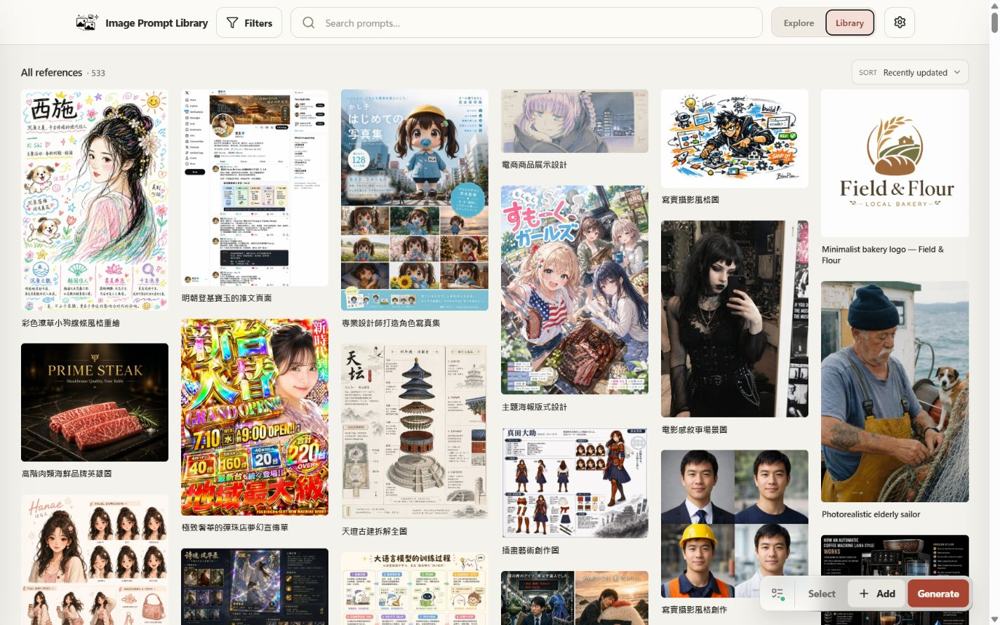
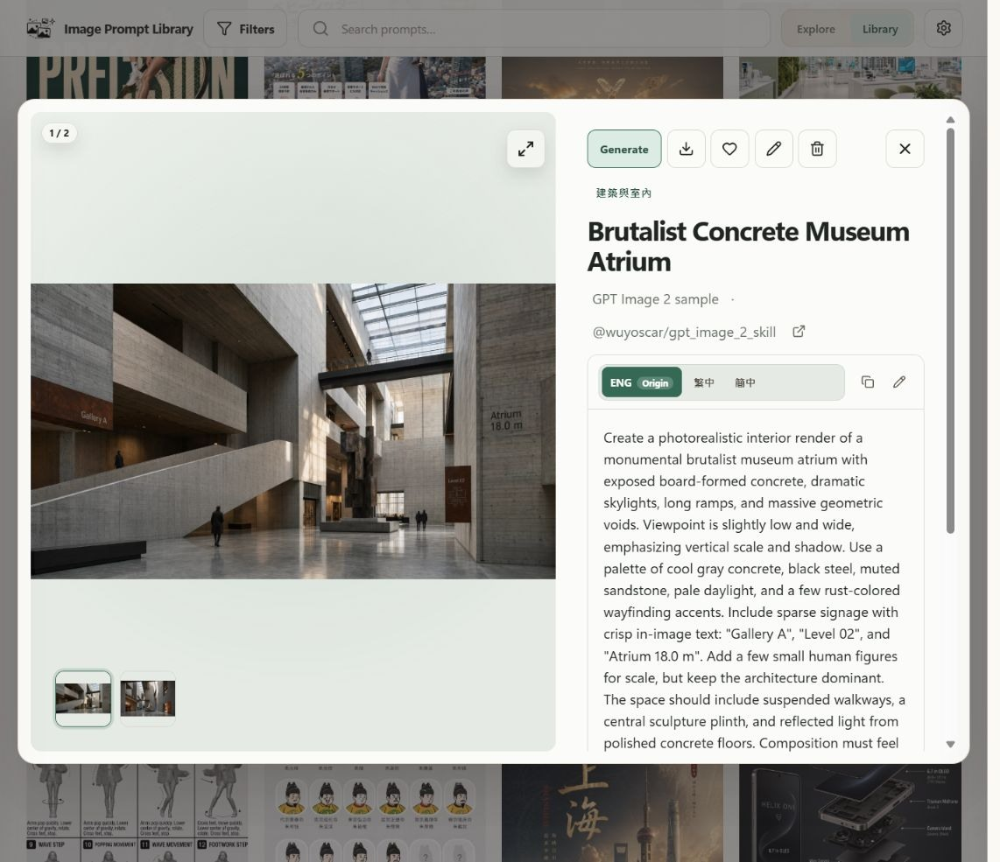
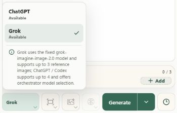
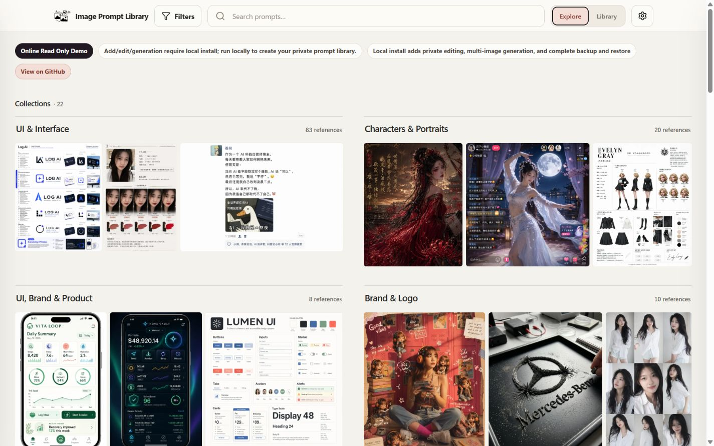

# Image Prompt Library

[](https://github.com/EddieTYP/image-prompt-library/actions/workflows/ci.yml)
[](https://github.com/EddieTYP/image-prompt-library/actions/workflows/pages.yml)
[](https://github.com/EddieTYP/image-prompt-library/releases/latest)
[](LICENSE)

[English](README.md) · **繁體中文** · [简体中文](README_zh-CN.md)

**Image Prompt Library** 是一個本地優先的圖片與提示詞收藏庫。把圖片、prompt、來源和備註一起保存，透過 collection、tag 和搜尋整理，方便之後找回及重用。

資料保存在本機 SQLite 和圖片檔案中。保存、搜尋和整理不需要帳號。你也可以選擇連接 ChatGPT 或 Grok 來生成圖片及建議標題；這些請求會由服務供應商的伺服器處理，並非在你的電腦上運行 AI 模型。



*本機 app 已載入可選範例資料。新安裝的收藏庫預設是空的。*

## 版本狀態

`v0.10.2` 已是目前 stable release，可從 [GitHub Latest](https://github.com/EddieTYP/image-prompt-library/releases/latest) 下載。**下文的 Grok、按 provider 建議標題及多圖管理功能將於 v0.11.0 提供**，尚未包含在目前的 stable 下載中。完整變更見 [v0.11.0 更新說明](docs/releases/v0.11.0.md)。

## 快速開始

### Windows

需要 Windows 10/11、PowerShell 5.1+ 及 **Python 3.10+**。請先安裝 Python；安裝程式不會代為安裝。

```powershell
irm https://raw.githubusercontent.com/EddieTYP/image-prompt-library/main/scripts/install.ps1 | iex
```

安裝後會在背景啟動 app 並開啟瀏覽器。使用 `image-prompt-library stop` 停止。

### macOS、Linux 與 WSL 2

需要 **Python 3.10+** 和 `curl`。使用 release 安裝不需要 Node.js。

```bash
curl -fsSL https://raw.githubusercontent.com/EddieTYP/image-prompt-library/main/scripts/install.sh | bash
image-prompt-library start
```

保持終端機開啟，並瀏覽 [http://127.0.0.1:8000](http://127.0.0.1:8000)。在該終端機按 `Ctrl-C` 可停止 server。

如希望先檢視安裝程式再執行，或需要更新、回復舊版、解除安裝，請看[安裝說明](docs/INSTALLATION.md)。啟動有問題時，可先執行 `image-prompt-library status` 和 `image-prompt-library doctor`，再參考[疑難排解](docs/TROUBLESHOOTING.md)。

### 保存第一個 prompt

新收藏庫預設是空的。選擇 **+ Add**，加入圖片、prompt 和標題後儲存。Collection、tag、備註和來源連結均可選填。

想先瀏覽範例，可選擇匯入一個 sample pack：

```bash
image-prompt-library sample-data en       # 英文 collection 名稱
image-prompt-library sample-data zh_hans  # 簡體中文 collection 名稱
image-prompt-library sample-data zh_hant  # 繁體中文 collection 名稱
```

只需執行偏好語言的指令。原始標題、prompt 及已有語言版本會保留，不會全部重新翻譯。另有較大的繁中範例包：

```bash
image-prompt-library sample-data zh_hant awesome-gpt-image-2
```

## 瀏覽與整理

- **Explore** 按 collection 展示圖片；**Library** 提供完整卡片列表及編輯工具。
- 原始 prompt 和翻譯可放在同一卡片，切換語言版本後即可閱讀或複製。
- 搜尋標題、prompt、tag、collection、來源及備註，亦可組合 `tag:portrait`、`collection:architecture`、`sort:title` 等結構化篩選。
- 選取多張卡片後，可批量加 tag、移動、收藏、封存或刪除。v0.11.0 的 **Tag** 會建議現有標籤；**Move** 可搜尋 collection，不用輸入完全相同的名稱。
- v0.11.0 可在同一卡片保存多張圖片。在 **Edit** 選擇封面、調整順序、更改結果圖／參考圖角色，或只刪除其中一張圖片。


*Explore 用於瀏覽 collection；Library 用於管理個別卡片。*



*同一卡片集中保存圖片、prompt 和來源。新生成的圖片亦會保留 provider 及 model 資料。*

## 使用 ChatGPT 或 Grok 生成圖片

圖片生成是可選功能，需要本機安裝及具相應權限的 provider 帳號。**v0.11.0 的 Grok OAuth 屬實驗功能。** 使用權限、配額和費用由 provider 決定；成功連接不代表免費或無限使用。這兩種 OAuth 連接不需要輸入 API key。

1. 開啟 **Config → Providers**，選擇 **ChatGPT / Codex OAuth** 或 **Grok OAuth**，在瀏覽器完成授權。如有提示，回到 app 按 **Check authorization**。
2. 選擇 **Default AI provider**。偏好會儲存在目前的瀏覽器；生成時仍可暫時轉用另一個 provider，不影響預設。
3. 開啟 **Generate**，輸入 prompt，可選擇加入參考圖。Prompt 可使用 `{{主體}}` 等變數，生成前先填入內容。
4. 選擇可用的比例、品質及其他選項。一次生成 1 張或一組 3、5、10 張，再從 **Work queue** 檢視結果。
5. 選擇 **Save as new item**，或附加至未經修改的來源卡片。檢視同一組結果時，之後的圖片可加入第一張結果建立的卡片，集中在同一詳情視窗瀏覽。

Grok 使用 `grok-imagine-image-2.0`，提供 Low／Medium 品質、1K／2K 解像度，最多三張參考圖。ChatGPT 最多支援四張參考圖，另有自己的 model 及品質選項。切換 provider 後會顯示相應控制。



*在生成視窗選擇當次使用的 provider，不會改動 Config 中的預設。*

### 建議標題

在 **Add**、**Edit** 或生成結果的儲存表單按 **Suggest title**，即可根據 prompt 文字取得短標題。先檢視建議，再按 **Use title** 套用；原標題不會自動被覆蓋。

一般新增／編輯使用預設 provider；生成結果會使用生成該圖的 provider，並顯示 **via ChatGPT** 或 **via Grok**。如該 provider 已斷線，app 會要求重新連接，不會靜默把 prompt 送到另一間服務。

詳細連接方法、參考圖限制及結果處理，請看[生成指南](docs/GENERATION.md)。

## 線上唯讀 demo

[開啟 demo](https://eddietyp.github.io/image-prompt-library/)，不用安裝即可瀏覽 collections、搜尋範例及複製公開 prompt。



*線上 demo 使用公開範例資料。編輯、私人收藏庫管理及圖片生成需要本機安裝。*

## Sample data 與 attribution

Demo 及可選範例包保留來源連結和授權資料。當中的 prompt 和圖片並非 Image Prompt Library 原創內容。

| 來源 | 授權 | 範例包 |
| --- | --- | --- |
| [wuyoscar/gpt_image_2_skill](https://github.com/wuyoscar/gpt_image_2_skill) | CC BY 4.0 | Starter pack |
| [freestylefly/awesome-gpt-image-2](https://github.com/freestylefly/awesome-gpt-image-2) | MIT | 較大的 prompt／圖片範例庫 |

範例包詳情及校驗碼見 [sample-data/README.md](sample-data/README.md)。

## 私隱

- 私人 prompt／圖片收藏庫留在你的電腦，沒有託管用戶資料庫或內建雲端同步。
- 生成圖片時，輸入的 prompt 和所選參考圖會傳送至你選擇的 provider。建議標題只傳送 prompt 文字，不會傳送圖片、現有標題、tag 或備註。
- Provider 憑證與收藏庫分開儲存，不會包含在可攜式備份或範例匯出中。
- App 預設只監聽 `127.0.0.1`。除非了解存取風險，否則不要開放至網絡。

## 文件

- [安裝與更新](docs/INSTALLATION.md)
- [圖片生成及建議標題](docs/GENERATION.md)
- [備份與還原](docs/BACKUP_AND_RESTORE.md)
- [疑難排解](docs/TROUBLESHOOTING.md)
- [開發環境](docs/DEVELOPMENT.md)及[參與開發](CONTRIBUTING.md)
- [Roadmap](ROADMAP.md)

## 授權

App 程式碼採用 **AGPL-3.0-or-later**，詳見 [LICENSE](LICENSE) 和 [NOTICE](NOTICE)。範例資料和第三方資產使用上表所列的獨立授權。

如需在 AGPL 以外的條款下使用，可聯絡維護者洽談商業授權。
