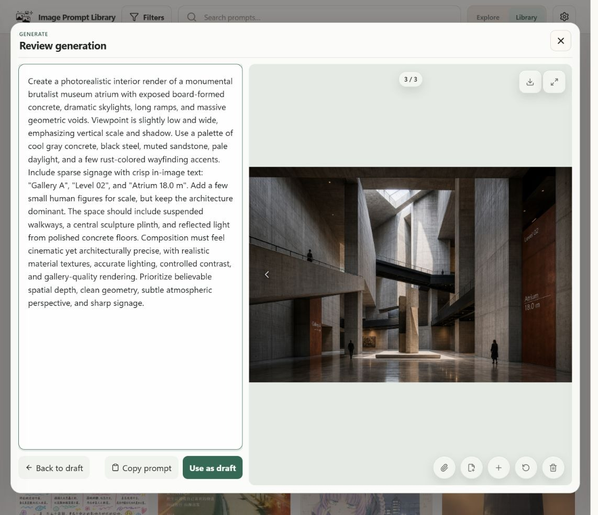
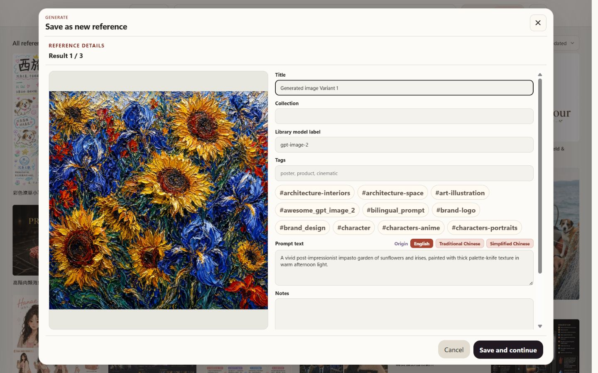

# Local Generation Guide

Local installs can generate images through **ChatGPT / Codex OAuth** or the experimental **Grok OAuth** provider. The GitHub Pages demo remains read-only.

## What the local generation flow does

Once connected, you can:

- Generate a new image from a fresh prompt.
- Queue a `Generation set` of 3, 5, or 10 independent variations from the same prompt and settings.
- Generate a variant from an existing reference.
- Review generated results before saving them into the library.
- Attach a result to its unchanged source item when available.
- Save a result as a new item with editable metadata.
- Keep useful generation details such as provider, model, original item, and batch position.
- Use prompt variables such as `{{subject}}`, `{{style}}`, or `{{主體}}` in reusable template prompts and fill them before each generation.

Neither OAuth connection requires entering an API key in the app. Access, quotas, and billing depend on the connected account; a successful connection or test does not establish future pricing.

## Privacy boundary

Generation is local-install only. The public GitHub Pages demo does not perform live imports or generation and does not expose Add/Edit/private-library controls.

The OAuth stores and provider config must be outside the active library. If `IMAGE_PROMPT_LIBRARY_AUTH_PATH`, `IMAGE_PROMPT_LIBRARY_GROK_AUTH_PATH`, or `IMAGE_PROMPT_LIBRARY_CONFIG_PATH` resolves to the library or one of its child paths, startup stops before reading the database or credentials.

Library-managed media roots (`originals`, `thumbs`, `previews`, `generation-results`, and `generation-references`) must stay inside the library. External symlink or junction targets are rejected. The app does not move or delete an unsafe file automatically.

If an override resolves inside the library, move the file to `~/.image-prompt-library/auth.json`, `~/.image-prompt-library/grok-auth.json`, or `~/.image-prompt-library/config.json`, then update or unset the override and restart. Treat older backups containing the file as sensitive, and reconnect the provider if a credential may have been exposed. Keep tokens out of git, sample bundles, backups, and GitHub Pages exports.

## Connect the provider

Open **Config → Providers**, then choose **Connect** under the provider you want to use. Follow the authorization link, enter the one-time code, approve the request, then return to Image Prompt Library and choose **Check authorization**.

The ChatGPT browser flow may label the request **Codex CLI**. Grok uses a separate xAI device-authorization flow and credential store. Only approve a flow you started from your local Image Prompt Library app. When setup is complete, the provider shows **Connected**. Grok remains experimental, and availability depends on the connected xAI account.

Under **Config → Providers**, choose a **Default AI provider** for new generation sessions and title suggestions. Only a connected provider that supports title suggestions can be selected. If that provider is disconnected later, the app keeps your choice and asks you to reconnect instead of silently sending the prompt to another provider.

## Suggest a title

**Suggest title** is an explicit action in Add, Edit, and generated-result save screens. It sends only the current prompt text to the selected provider; it does not send the image, existing title, tags, Collection, source details, or other Library metadata. The suggestion is shown for review and is not applied until you choose **Use title**.

Normal Add and Edit screens use the **Default AI provider**. When saving a generated result, the app uses the provider that created that result when it supports title suggestions; manual or unsupported results use the default. The suggestion identifies its source as **via ChatGPT** or **via Grok**.

ChatGPT title suggestions use the existing ChatGPT / Codex OAuth connection. Grok title suggestions use `grok-4.6` through the xAI Responses API with response storage disabled. The public demo never sends title-suggestion requests.

## Generate and review results

Open **Create image**, enter a prompt, and choose settings. The composer starts with your **Default AI provider**, and its provider control can override that choice for the current session. **Generate** creates one result; the adjacent menu creates 3, 5, or 10. Each result uses a separate generation request. Template prompts can include `{{variables}}`; the composer previews the resolved prompt before sending.

When ChatGPT / Codex OAuth is selected, the built-in choices are `gpt-5.6-terra`, `gpt-5.6-sol`, and `gpt-5.6-luna`. The default is **Recommended · gpt-5.6-terra**. Existing custom model overrides remain available.

For Grok, the composer uses `grok-imagine-image-2.0` and exposes Low or Medium quality, 1K or 2K resolution, and up to three ordered reference images.

Review completed results from the **Work queue**. For each result, choose **Save as new item**, **Use result as edit input**, **Retry**, or **Discard**. **Attach to current item** is also available when the result came from an unchanged saved reference. **Use as draft** copies the result's prompt and reusable settings back into the composer. Batch review keeps each result's position and advances to the next unfinished result. Using a result as a draft or edit input pauses review; **Continue review** returns to the remaining results.

Queued and running jobs remain in the Work queue if you close or refresh the page. Deleting a source reference does not cancel them; completed detached results can still be saved as new items.

  

Review each result before you save, reuse, retry, or discard it.

Before saving a result as a new reference, edit its details. The read-only generation record shows the provider, model, batch position, and original item when available. Internal identifiers are not displayed.

  

Edit the details before saving the result to your library.

## When generation fails

The app gives a short next step for each failure:

- If the prompt is blocked, edit it and generate again.
- If the provider rate-limits requests, the failed result stays available for manual retry while untouched queued jobs wait.
- If the provider is unavailable, retry shortly; the prompt and references stay with the job.
- If authorization is required, open **Config → Providers**, reconnect, then retry.
- For other failures, retry the result or edit the prompt first.

The composer can show the sanitized provider error under **Provider details** as secondary diagnostic text. The queue intentionally shows only the classified guidance. Neither surface displays credentials or unsanitized provider responses.

## Current provider notes

The local queue has no artificial submission cap and runs up to five generation jobs at once. Additional jobs wait in the Work queue.

If the provider reports a rate limit, the app pauses that provider's queue before continuing untouched queued jobs. The failed result stays failed until you retry it. Normal OAuth renewal happens in the background; reconnect only when the app says authorization is required.

### Observed Grok output sizes (2026-08-30)

This compatibility check covered all 24 combinations exposed by the composer: two quality settings, two resolution settings, and six aspect ratios. Each request used `grok-imagine-image-2.0` through the local xAI device-OAuth path, with the prompt `A flat red circle centered on a plain white background.`, no reference images, and no automatic retries.

All 24 requests succeeded. In this run, Low and Medium returned the same size for each aspect-ratio and resolution pair.

| Requested aspect ratio | Observed 1K dimensions | Observed 2K dimensions |
| --- | ---: | ---: |
| Auto | 1024 × 1024 | 2048 × 2048 |
| 1:1 | 1024 × 1024 | 2048 × 2048 |
| 3:4 | 864 × 1152 | 1776 × 2368 |
| 9:16 | 720 × 1280 | 1584 × 2816 |
| 4:3 | 1152 × 864 | 2368 × 1776 |
| 16:9 | 1280 × 720 | 2816 × 1584 |

Interpretation:

- This was a compatibility check with one request per combination, not an image-quality benchmark or provider contract.
- Auto produced a square image for this prompt. This run does not establish how Auto behaves with other prompts.
- Non-square 2K results preserved the requested aspect ratio and had a long edge above 2048 pixels. Treat 2K as a provider tier, not a fixed edge length.
- The measurements reflect the 2026-08-30 run and do not establish billing or quota terms.

## Benchmark note

While building Image Prompt Library's Image 2.0 generation workflow, the project benchmarked GPT-5.5, GPT-5.4, and GPT-5.3-Codex across Low, Medium, and High quality. These are historical results, not the current model catalogue.

The current app receives its selectable orchestrator models and default from provider status. The built-in choices are `gpt-5.6-terra`, `gpt-5.6-sol`, and `gpt-5.6-luna`; `gpt-5.6-terra` is the recommended default. Users can still change the model and quality manually.

See the benchmark notes and images in [`generation-matrix-chatgpt-codex-impasto-florals-2026-05-01.md`](generation-matrix-chatgpt-codex-impasto-florals-2026-05-01.md).
